# 3D 프린트 출력 정리 (.3mf)

## 1. 장비 정보

- **프린터**
  - BambuLab A1
  - BambuLab A1 mini
- **노즐**
  - 0.4 mm Stainless Steel

## 2. 출력 프로세스(주요 설정)

- 베이스 프로파일: **0.20 mm Strength**
- 초기 레이어 두께: **0.47 mm**
- X–Y 구멍 수평 확장: **0.25 mm**
- 벽 두께 / 강도 / 서포트:
  - 소요 시간과 모델 형태에 따라 **케이스별 조정**

---

## 3. 전체 출력 요약

| 항목                                | 값                        |
| ----------------------------------- | ------------------------- |
| **총 출력 시간**                    | **102h 26m**              |
| **모든 파일 총 필라멘트 사용량**    | **4600.14 g (≈ 4.60 kg)** |
| **모든 파일 총 모델 필라멘트 무게** | **4182.23 g (≈ 4.18 kg)** |

---

## 4. 파트별 상세 정보

### 4.1 머리(Head)

#### 머리 v2

- **시간**: 7h 29m
- **필라멘트**: 220.77 g
- **모델 필라멘트**: 173.13 g

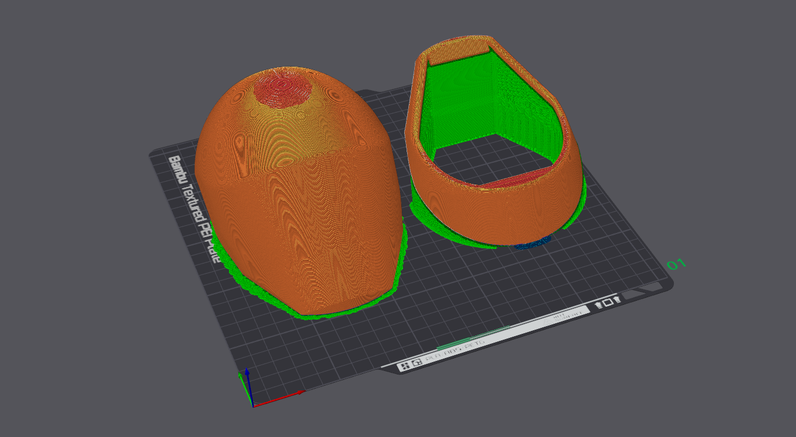

#### 턱 연결파츠 v3

- **시간**: 1h 29m
- **필라멘트**: 39.92 g
- **모델 필라멘트**: 35.56 g

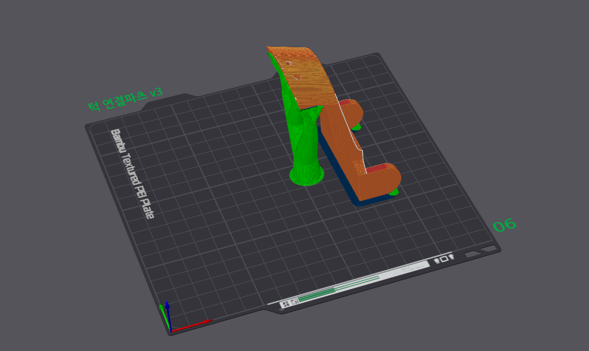

---

### 4.2 목(Neck)

#### 상체와 연결 부위(어깨 연결 v2)

- **시간**: 2h 26m
- **필라멘트**: 86.87 g
- **모델 필라멘트**: 86.84 g

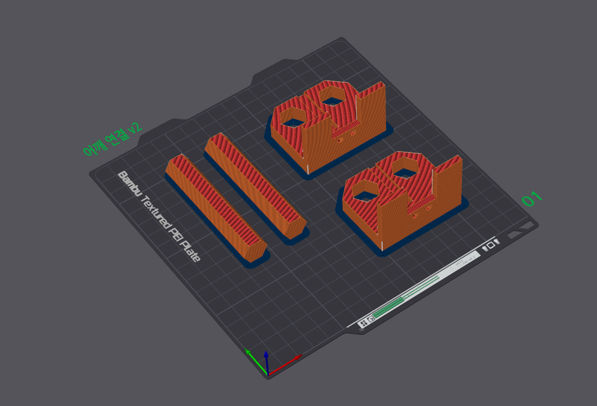

---

### 4.3 상체(Upper Body)

#### 상체 전면

- **시간**: 13h 20m
- **필라멘트**: 473.25 g
- **모델 필라멘트**: 412.42 g

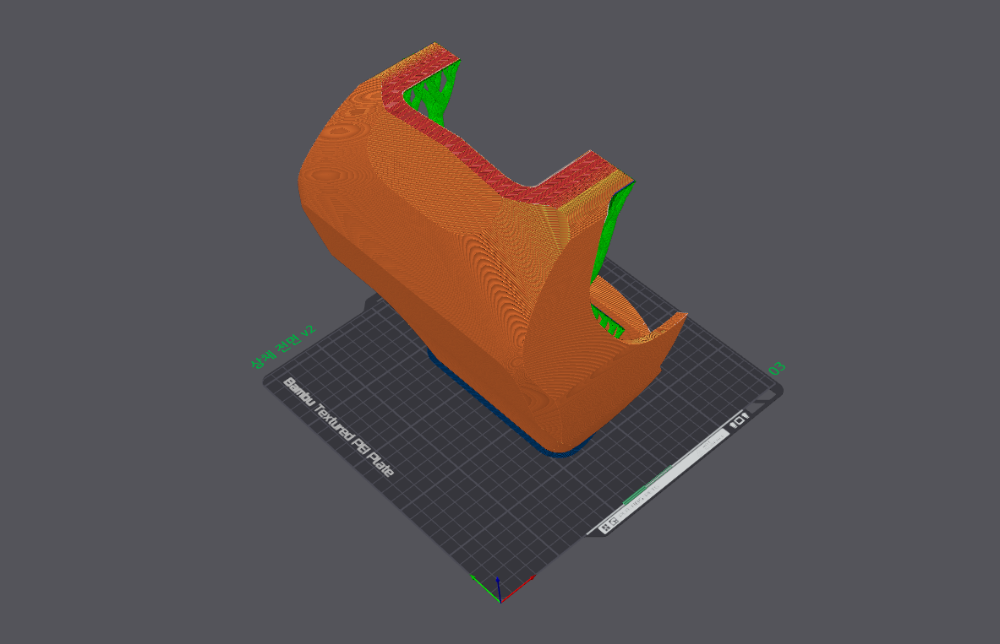

#### 상체 후면

- **시간**: 7h 48m
- **필라멘트**: 241.95 g
- **모델 필라멘트**: 207.61 g

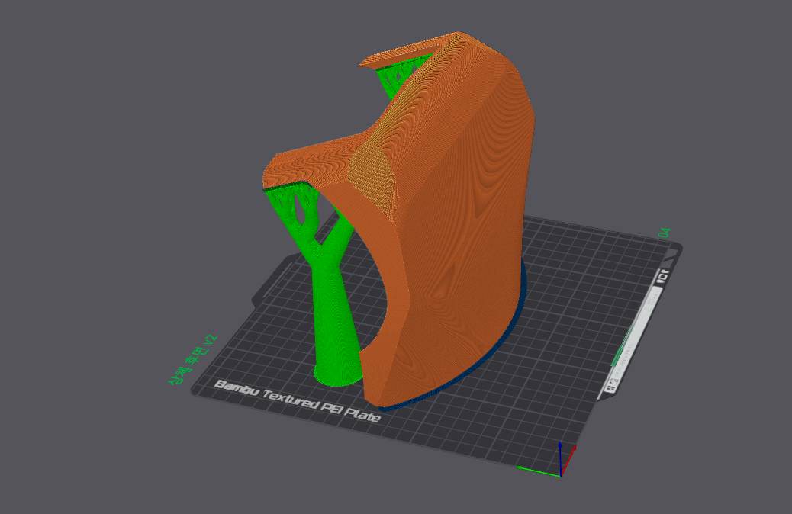

#### 상체 허리 연결 부위

- **시간**: 4h 37m
- **필라멘트**: 150.74 g
- **모델 필라멘트**: 117.70 g

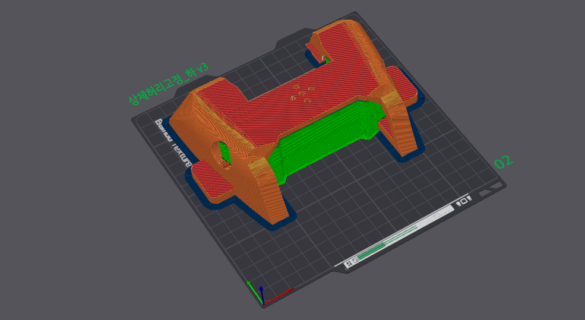

#### 어깨 커버 좌우

- **시간**: 5h 31m
- **필라멘트**: 268.82 g
- **모델 필라멘트**: 252.48 g

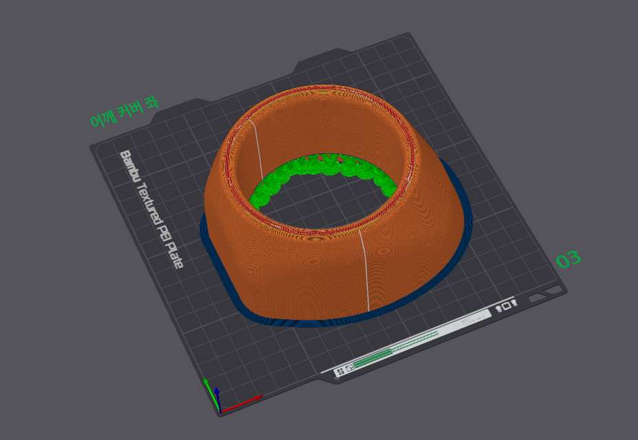  
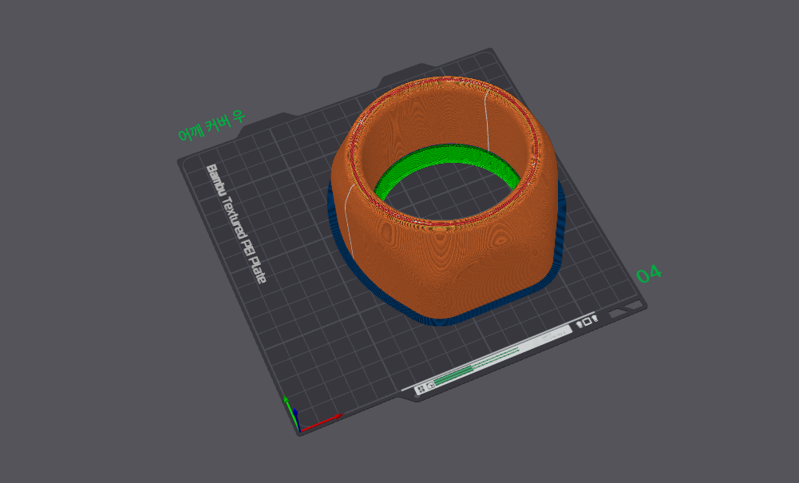

#### 어깨 목 연결 부위

- **시간**: 7h 24m
- **필라멘트**: 264.40 g
- **모델 필라멘트**: 262.65 g

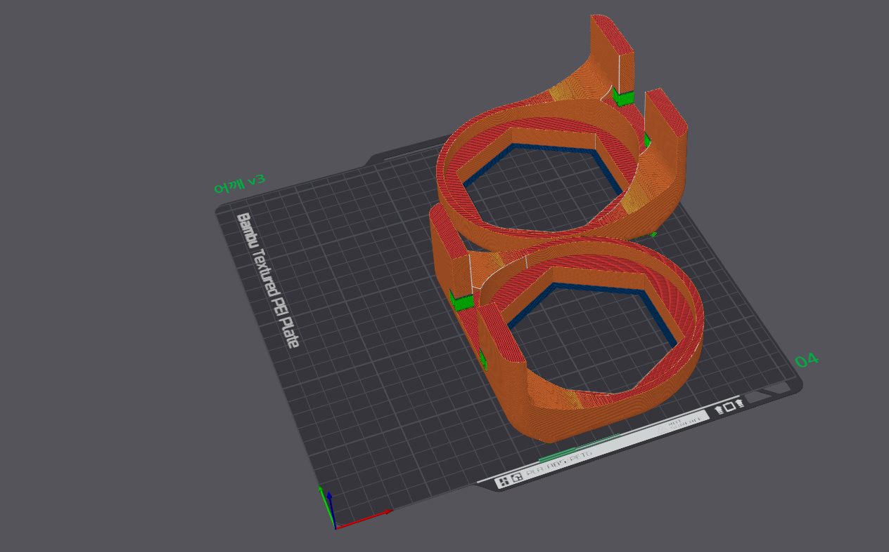

#### 허리 고정 받침 좌우

- **시간**: 2h 52m
- **필라멘트**: 103.73 g
- **모델 필라멘트**: 103.73 g

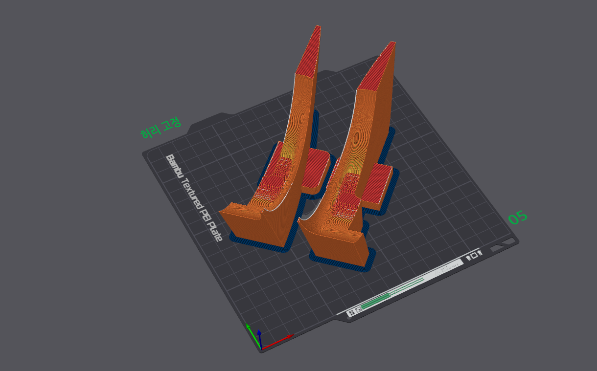

#### 로봇 팔 연결 부위

- **시간**: 5h 14m
- **필라멘트**: 264.23 g
- **모델 필라멘트**: 264.23 g

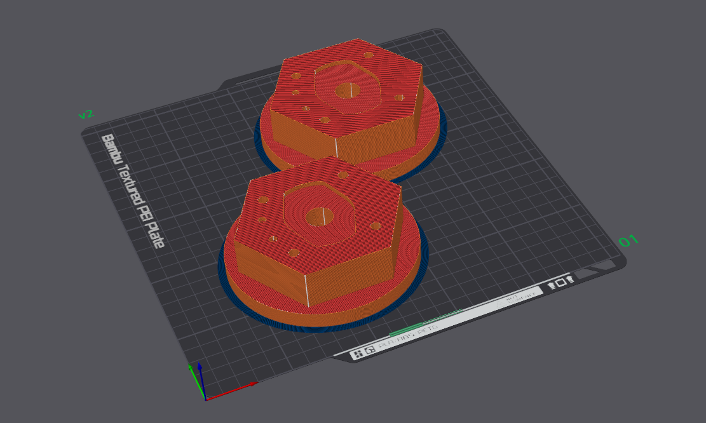

---

### 4.4 하체(Lower Body)

#### 골반

- **시간**: 13h 35m
- **필라멘트**: 737.66 g
- **모델 필라멘트**: 696.91 g

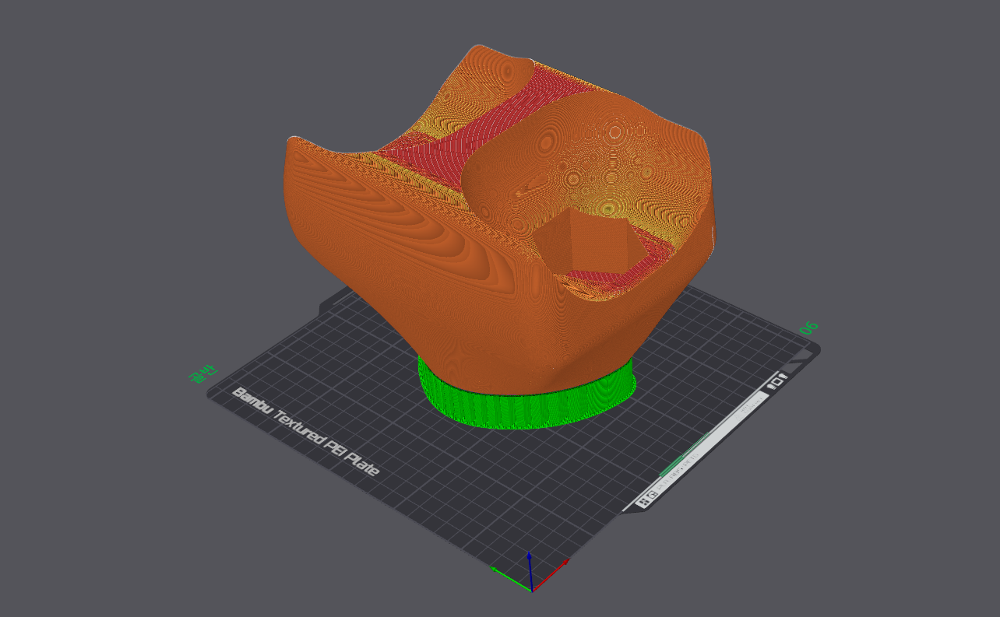

#### 허벅지 - 1층

- **시간**: 21h 3m
- **필라멘트**: 1194.28 g
- **모델 필라멘트**: 1015.45 g

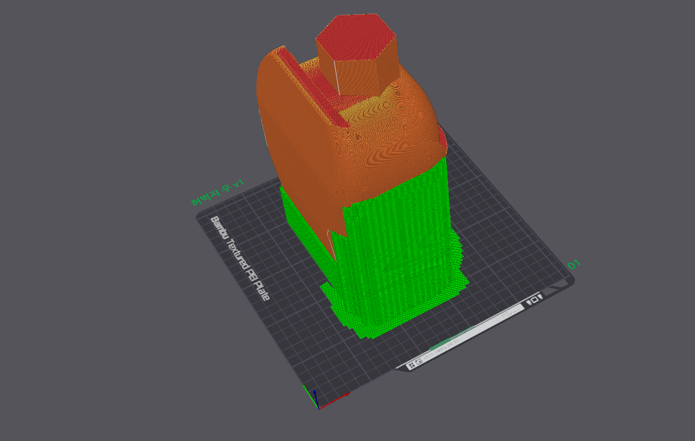  
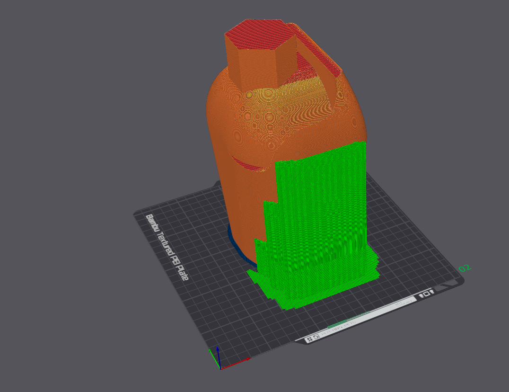

#### 허벅지 - 2층

- **시간**: 3h 44m
- **필라멘트**: 223.13 g
- **모델 필라멘트**: 223.13 g

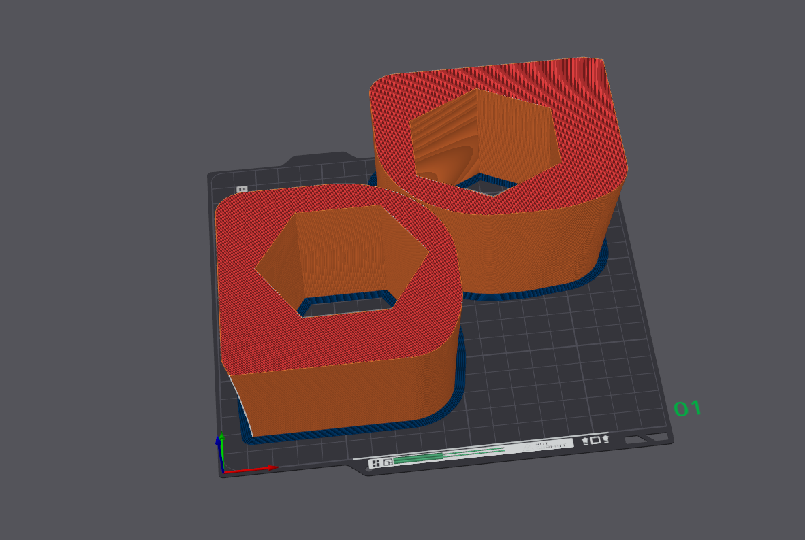

#### 하체 무릎 고정판

- **시간**: 5h 54m
- **필라멘트**: 330.39 g
- **모델 필라멘트**: 330.39 g

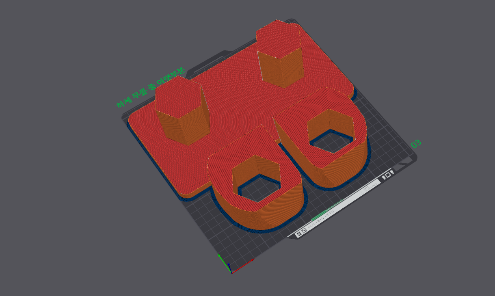
