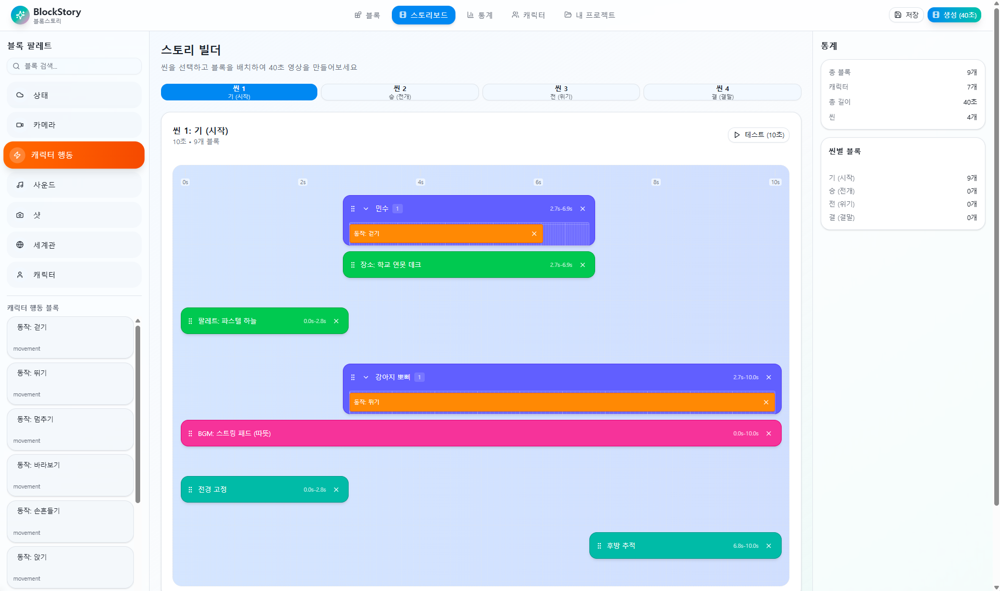

# 2025년 10월 15일 TIL

## 새로운 프로젝트 구상

> 모모코(Motion + Emotion + Coding) — 블록프롬프팅을 통한 영상 이야기 생성 도구

### 회의 이후 추가된 내용

> 실시간 대화 AI를 통해 아이가 원하는 내용을 바로 블럭으로 생성하는 기능

### 프로젝트 설명

### 1️⃣ 우리 아이의 상상력을 '눈에 보이게' 만드는 코딩

보통 코딩 교육은 '로봇을 움직인다'거나 '명령을 따라 숫자를 계산한다'는 식으로

논리 중심이라 **창의성이나 감정 표현이 부족**합니다.

모모코는 아이가 **블록을 조립해 만든 이야기(기·승·전·결)** 를

AI가 **10초짜리 애니메이션 영상과 음악**으로 바꿔주는 서비스예요.

아이의 머릿속 상상이 실제 영상으로 눈앞에 펼쳐집니다.

"내가 만든 이야기가 영화처럼 나온다"는 경험이 아이에게 **큰 자신감과 성취감**을 줍니다.

---

### 🧠 2️⃣ 단순한 코딩이 아닌 '감정과 스토리의 코딩'

아이들은 '왜 주인공이 슬펐을까?', '비가 오면 음악이 어떻게 변할까?'를 생각하며

자연스럽게 **감정, 상황, 논리, 순서**를 연결합니다.

이 과정에서 코딩의 기본 개념인 **조건, 순서, 결과**를 감정과 이야기로 배웁니다.

즉, 단순한 "프로그래밍"이 아니라

**감정 표현력 + 논리적 사고 + 상상력**을 동시에 자극하는 창의 활동이에요.

---

### 🎨 3️⃣ 글보다 영상에 익숙한 세대에 맞춘 창의 학습

요즘 아이들은 글보다 **영상으로 생각하고 표현하는 세대**입니다.

하지만 대부분의 교육 콘텐츠는 여전히 텍스트 중심이죠.

모모코는

- 글을 잘 쓰지 않아도,
- 그림을 잘 그리지 않아도,
  아이 스스로 블록을 쌓아가며 "나만의 영상"을 만들 수 있게 도와줍니다.

이는 **디지털 표현력**을 키우고,

AI 시대의 핵심 역량인 **'기획 → 표현 → 피드백' 능력**을 자연스럽게 익히게 합니다.

---

### 🌱 4️⃣ "정답이 없는" 창의 수업

이 프로젝트엔 '틀린 답'이 없습니다.

같은 감정 블록을 써도 어떤 아이는 잔잔한 이야기를, 다른 아이는 모험 이야기로 만들 수 있습니다.

AI가 그 차이를 영상으로 표현해주니

아이 스스로 "내가 만든 이야기와 친구의 이야기가 이렇게 다르구나"를 느낍니다.

이건 단순한 학습이 아니라 **자기표현과 공감 능력의 성장 과정**이에요.

---

### 🧩 5️⃣ 아이가 'AI를 배우는 가장 자연스러운 방법'

요즘 "AI 리터러시"라는 말을 많이 하지만, 아이에게 인공지능을 이론으로 가르치기는 어렵습니다.

모모코는 아이가 직접 AI와 협업하면서 **몸으로 배우는 방식**입니다.

"내가 만든 스토리를 AI가 영상으로 바꿔줬어!"

→ 이 한 문장 안에 **AI의 원리, 가능성, 책임감**이 모두 담겨 있어요.

즉, AI를 사용하는 법을 배우는 게 아니라 **AI와 함께 '창작하는 경험'을 배우는 것**입니다.

---

### 🌟 6️⃣ 우리 아이에게 남는 것

| 성장 영역    | 아이가 얻는 경험                               |
| ------------ | ---------------------------------------------- |
| 🌈 감정 표현 | 감정·날씨·음악의 관계를 느끼며 표현력 향상     |
| 🧩 논리 사고 | 장면의 순서·조건·결과를 코딩 블록으로 조립     |
| 🎨 창의력    | 자신의 상상을 시각·음향으로 구체화             |
| 🧠 자기주도  | "내가 만든 이야기"를 끝까지 완성하는 몰입 경험 |
| 🤝 공감·소통 | 친구들과 서로의 작품을 보고 감정을 나누는 활동 |

# 🌈 우리 아이가 모모코를 사용하는 과정

---

### 1️⃣ 이야기 만들기 (생각 꺼내기)

아이에게 먼저 주제가 주어집니다.

예를 들어 "비 오는 날의 하루", "학교에서 있었던 일" 같은 간단한 주제예요.

아이들은 머릿속으로 그림을 떠올리며,

"처음엔 뭐가 일어나고(기), 그다음엔 어떤 일이 생기고(승), 마지막엔 어떻게 될까(결)?"

이렇게 **이야기의 흐름을 구상**합니다.

> 이 단계에서는 글을 잘 쓰지 않아도 괜찮아요.
>
> 그림이나 말로 이야기해도 AI가 이해할 수 있게 도와줍니다.

---

### 2️⃣ 블록을 조립해 이야기 구성하기

화면에는 '장면 블록'이 네 개(기·승·전·결) 나옵니다.

아이들은 블록을 끌어서 각 장면에 들어갈 내용을 정합니다.

예를 들어:

- **감정** 블록 → "슬픔", "기쁨"
- **날씨** 블록 → "맑음", "비", "눈"
- **시간대** 블록 → "오후", "저녁"
- **캐릭터 행동** 블록 → "걷기", "웃기", "생각하기"

이렇게 선택만 해도 AI가 자동으로

"비 오는 오후, 아이가 하늘을 바라본다" 같은 문장을 만들어 냅니다.

> 복잡한 코드를 몰라도, 블록을 조립하는 것만으로 '코딩'이 완성됩니다.

---

### 3️⃣ AI가 이야기 이해하기

아이의 블록 조합이 끝나면

AI가 전체 이야기를 읽고 **"이 장면은 어떤 분위기일까?"** 를 스스로 판단합니다.

감정과 날씨를 분석해 "슬픈 장면엔 느린 피아노",

"기쁜 장면엔 밝은 멜로디", "비 오는 장면엔 잔잔한 소리"처럼

자동으로 **음악과 사운드를 추천**합니다.

---

### 4️⃣ 영상 자동 생성 (AI의 마법)

이제 "영상 만들기" 버튼을 누르면,

AI가 각 장면을 10초짜리 영상으로 만듭니다.

아이는 잠시 기다리는 동안

화면 속에서 자신의 이야기가 하나의 영화처럼 만들어지는 걸 보게 됩니다.

> "내가 만든 이야기가 진짜 영상으로 나온다!"
>
> — 이 순간의 놀라움이 아이들에게 **창의적 자신감**을 줍니다.

---

### 5️⃣ 나만의 이야기 상영회

AI가 만든 네 장면을 자동으로 이어 붙여 **40초짜리 영상**으로 완성합니다.

- 첫 번째 장면(기): 이야기가 시작되는 순간
- 두 번째 장면(승): 문제나 사건 발생
- 세 번째 장면(전): 해결의 실마리
- 네 번째 장면(결): 행복한 마무리

아이들은 친구들과 서로의 영상을 보며

"너는 비가 왔네!", "나는 눈이 왔어!" 하며 감정을 나눕니다.

이건 단순한 감상 시간이 아니라,

**다른 사람의 표현을 이해하고 공감하는 연습**이기도 합니다.

---

### 6️⃣ 교사·부모 확인 및 공유

완성된 영상은 교사 또는 부모 승인 후에만 저장·공유됩니다.

- 수업에서는 **교사가 학생 작품 상영회**를 진행하고,
- 가정에서는 **부모님이 아이의 영상 결과물**을 휴대폰이나 태블릿으로 볼 수 있습니다.

아이의 스토리가 그대로 영상으로 남으니,

**디지털 성장 앨범**처럼 추억으로 기록할 수도 있습니다.

---

### 7️⃣ 아이에게 남는 경험

| 경험           | 설명                                          |
| -------------- | --------------------------------------------- |
| 💭 상상력      | 머릿속 장면을 이야기로 정리하고 영상으로 표현 |
| 🎨 창의력      | 음악·색감·감정을 스스로 선택하며 표현         |
| 🧩 논리적 사고 | '순서'와 '원인–결과'를 구조적으로 학습        |
| 🤖 AI 이해     | AI가 어떻게 영상을 만드는지 직접 체험         |
| ❤️ 자신감      | "내가 만든 게 영화가 됐어!" 라는 성취감       |

---

## 🧩 모모코 - 블록 종류와 의미의 이해

---

### 🎬 1️⃣ 장면 블록 (Scene Block)

이야기의 큰 틀을 만드는 **기–승–전–결** 4개의 기본 블록이에요.

각 장면마다 다른 감정, 날씨, 배경 등을 조합할 수 있습니다.

| 블록              | 의미                                 | 예시                             |
| ----------------- | ------------------------------------ | -------------------------------- |
| 🟦 **기(시작)**   | 이야기가 시작되는 배경과 분위기      | "맑은 아침, 아이가 학교로 간다"  |
| 🟨 **승(변화)**   | 사건이나 감정이 일어나는 부분        | "갑자기 비가 내리기 시작한다"    |
| 🟥 **전(전환)**   | 이야기의 갈등이나 해결의 실마리      | "친구가 우산을 내민다"           |
| 🟩 **결(마무리)** | 감정이 정리되고 결말이 맺어지는 부분 | "두 아이가 함께 집으로 걸어간다" |

> 👉 아이는 네 개의 블록을 순서대로 쌓으며 자연스럽게 '스토리 구조'를 배웁니다.

---

### ☁️ 2️⃣ 상태 블록 (State Block)

이야기의 분위기나 감정을 표현하는 블록이에요.

AI가 이 정보를 바탕으로 **조명·색감·음악 톤**을 결정합니다.

| 종류             | 선택 항목                               | AI 해석 예시                   |
| ---------------- | --------------------------------------- | ------------------------------ |
| ☀️ **날씨**      | 맑음 · 흐림 · 비 · 눈 · 바람 · 천둥     | 장면 색감과 배경 사운드에 반영 |
| 😊 **감정**      | 행복 · 슬픔 · 긴장 · 놀람 · 평온 · 분노 | 음악 분위기와 캐릭터 표정 결정 |
| 🌇 **시간대**    | 아침 · 낮 · 오후 · 저녁 · 밤            | 하늘색·조명 톤 변화            |
| 💡 **조명 무드** | 밝음 · 부드러움 · 따뜻함 · 차가움       | 그림자·광원의 색감 표현        |

> 👉 같은 이야기라도 감정과 날씨 블록 조합에 따라 완전히 다른 영상이 나옵니다.
>
> 예: "비 오는 오후의 슬픔" vs "맑은 아침의 행복"

---

### 👧 3️⃣ 캐릭터 블록 (Character Block)

등장인물의 행동을 표현하는 블록이에요.

직접 애니메이션을 만들지 않아도, AI가 동작을 해석해 장면을 구성합니다.

| 종류             | 행동 예시                       | AI 해석                      |
| ---------------- | ------------------------------- | ---------------------------- |
| 🚶 **행동**      | 걷기 · 뛰기 · 멈추기 · 바라보기 | 움직임과 카메라 구도에 반영  |
| 😮 **표정**      | 웃기 · 놀라기 · 생각하기        | 얼굴 감정과 음악 템포 변경   |
| 👋 **상호작용**  | 인사하기 · 도와주기 · 건네기    | 두 인물의 거리감 표현        |
| 🎯 **의도/결심** | 시도하기 · 포기하기 · 결심하기  | 장면 전환의 리듬과 색감 변화 |

> 👉 아이는 이 블록을 통해 '감정이 행동으로 드러난다'는 걸 배웁니다.

---

### 🌍 4️⃣ 배경 블록 (Background Block)

장면이 어디서 벌어지는지 정하는 블록이에요.

AI는 장소에 맞게 구도와 색을 조정합니다.

| 예시                                                          | 설명                                     |
| ------------------------------------------------------------- | ---------------------------------------- |
| 학교 · 운동장 · 골목길 · 공원 · 바닷가 · 집 안                | 각각의 장소 분위기에 맞게 색감·조명 조절 |
| 예: "비 오는 운동장" → 젖은 바닥, 회색 톤, 잔잔한 피아노 음악 |                                          |

> 👉 아이는 "공간"이 이야기의 감정을 바꿀 수 있다는 걸 경험하게 돼요.

---

### 🎵 5️⃣ 음악 & 사운드 블록 (Sound Block)

이야기의 분위기에 어울리는 배경음을 지정하거나,

AI에게 "자동으로 어울리는 음악을 골라줘"라고 맡길 수도 있어요.

| 종류                  | 기능                                                |
| --------------------- | --------------------------------------------------- |
| 🎶 **BGM 자동 생성**  | 감정·날씨·시간대 조합으로 AI가 자동 작곡            |
| 🔉 **효과음 추가**    | "비 소리", "바람", "발자국", "문 여는 소리" 등 선택 |
| 🔇 **대사 없음 모드** | 순수한 감정 전달 중심의 장면 생성                   |

> 👉 아이는 "소리도 이야기의 일부"라는 걸 배웁니다.

---

### ⚙️ 6️⃣ AI·연출 보조 블록 (AI Helper Block)

조금 더 고학년용으로, AI에게 직접 지시할 수 있는 블록이에요.

| 블록 이름             | 설명                                                            |
| --------------------- | --------------------------------------------------------------- |
| 🎥 **샷 지정**        | 전경(멀리), 근경(가까이), 패닝(좌우 이동) 등 카메라 움직임 설정 |
| 🧠 **AI 추천 받기**   | "이 감정에 어울리는 음악을 추천해줘"                            |
| 🪄 **AI 코치 피드백** | AI가 "조금 더 밝은 분위기로 바꿔볼까?" 식으로 조언 제공         |

> 👉 아이가 단순 소비자가 아니라, AI와 협업하는 창작자로 참여하게 됩니다.

---

### 🏁 7️⃣ 마무리 블록 (Result Block)

모든 장면이 완성되면

"🎬 영상 만들기" 블록을 클릭해 **AI 영상 생성**을 시작합니다.

AI가 자동으로 각 장면을 10초로 만들어 **총 40초짜리 이야기 영상**을 완성합니다.

---

# 모코코: 아이가 만든 영상을 활용하는

---

### 🏠 가정 내 '디지털 성장 기록'으로 저장

**활용 방식:**

- 아이의 영상 결과를 연도별로 저장해 **디지털 포트폴리오**로 축적
- "아이의 상상력·감정 변화 기록"으로 부모와 함께 되돌아보기

**부모 활용 포인트:**

- 성장 과정에서 표현 방식의 변화를 비교
- 부모–아이 대화의 소재로 사용 ("작년엔 해가 떴는데, 올해는 비가 왔네?")

**확장 아이디어:**

- 영상을 자동으로 스토리북(PDF)이나 포스터로 변환 → 추억 앨범 형태로 보관

---

### 🎯 AI·블록코딩·STEAM 교육 효과

→ 블록 코딩에서 블록 프롬프팅으로 바껴서 내용 변경 필요

#### 1️⃣ 블록코딩 교육의 효과

- **논리적 사고력** 향상: Scratch·로봇코딩 수업 후 논리·문제해결 점수가 평균 20~40% 향상.
- **창의성 향상:** 고등학생 대상 연구에서 창의적 문제해결력 평균 78점 상승.
- **유아 단계에서도 효과:** 5~6세 유아가 블록로봇 코딩 참여 후 **문제해결력·언어·그림 창의성**이 유의하게 상승.
- **협력·소통능력** 향상: 메타분석상 효과크기 _d ≈ 0.8 ~ 0.9_ (매우 큼).

---

#### 2️⃣ AI 기반 창의교육에 대한 학부모 인식

- **긍정적 인식:**
  - 한국: 학부모 93% 가 "AI·코딩 교육은 필수" 로 인식.
  - 미국: 부모 88% 가 "AI는 미래교육에 필수적" 이라 응답.
- **우려 요인:**
  - 70% 이상 "AI가 창의성 저해할 수 있다" 걱정.
  - 85% "13세 이하 자녀의 AI 활용 관리 필요."
- **결론:** 학부모는 "AI = 필요하지만 안전하게 도입되어야 한다" 는 입장.

---

### 🌈 우리 아이가 배우는 "AI·블록코딩 창의교육"

---

#### 🧩 1️⃣ 블록코딩은 아이의 "생각하는 힘"을 키웁니다

- 여러 연구에서 블록코딩을 배운 아이들은
  **논리력, 문제해결력, 창의력**이 눈에 띄게 향상되었습니다.
- 예를 들어, 고등학생을 대상으로 한 연구에서는
  코딩 수업을 들은 학생들의 **창의적 문제해결 능력이 70점 이상 상승**했습니다.
- 초등학생에게 Scratch(스크래치)로 과학 단원을 가르쳤을 때는
  **논리적으로 사고하고 스스로 해결책을 찾는 능력이 크게 개선**되었습니다.
- 유아를 대상으로 한 로봇 코딩 실험에서도
  **그림 그리기, 이야기 만들기, 협동심, 말하기 능력**이 함께 향상되었습니다.

👉 즉, 블록코딩은 "컴퓨터 언어"가 아니라,

아이 스스로 **생각을 구조화하고 문제를 단계적으로 해결하는 연습**입니다.

놀이처럼 즐기며 논리력과 창의력을 동시에 키우는 교육이에요.

---

#### 🤖 2️⃣ AI 창의교육은 부모 10명 중 9명이 "필수"라고 답했습니다

- 전국 학부모 300명 조사 결과,
  **93%가 "AI·코딩 교육은 국어·수학만큼 중요하다"**,
  92%가 "자녀에게 AI 교육을 시킬 의향이 있다"고 답했습니다.
- 해외에서도 88%의 부모가 "AI는 자녀의 미래 진로에 꼭 필요하다"고 응답했습니다.
- 학부모 대부분은 "AI가 아이의 학습을 더 풍부하게 해줄 것"이라 기대하고 있습니다.

👉 AI 교육은 더 이상 선택이 아니라,

**미래를 대비하는 기본 역량**으로 자리 잡고 있습니다.

특히 영상, 음악, 스토리 등 **창의적인 분야에서의 AI 활용**은

아이의 상상력을 넓혀주는 도구로 인식되고 있습니다.

---

#### 🎬 3️⃣ 영상으로 표현하는 수업은 "자신감"을 키웁니다

- 초등학생을 대상으로 한 실험에서,
  직접 영상을 만들어 발표한 아이들은 **자신감과 표현력**이 크게 향상되었습니다.
- 단 2주 동안 동화를 영상으로 만드는 수업만으로도
  아이들이 **자신의 생각을 말하고, 친구와 협력하는 능력**이 높아졌습니다.
- 교사들은 **"수줍음 많던 아이가 자신의 이야기를 영상으로 만들며**
  또래 앞에서 자연스럽게 발표하는 모습을 보였다"고 말합니다.

👉 아이가 만든 영상은 단순한 결과물이 아니라,

**'내가 만든 이야기'를 세상과 나누는 경험**이에요.

이를 통해 **표현력·자신감·소통력**이 함께 자랍니다.

---

#### 🔬 4️⃣ STEAM(융합) 교육은 "몰입과 성취"를 이끕니다

- STEAM(과학·기술·공학·예술·수학 융합) 수업을 받은 아이들은
  **학습 흥미와 집중도, 성적**이 모두 향상되었습니다.
- 초등학교 실험에서는 STEAM 수업을 받은 학생들이
  **과학 성취도와 학습 의욕이 뚜렷하게 높아졌고**,
  "직접 만들어보는 수업이 재미있다"는 반응이 많았습니다.
- 해외에서도 60여 개 연구를 종합한 결과,
  융합형 수업을 받은 아이들이 일반 수업보다 **성취도가 약 40~50% 높게** 나타났습니다.
