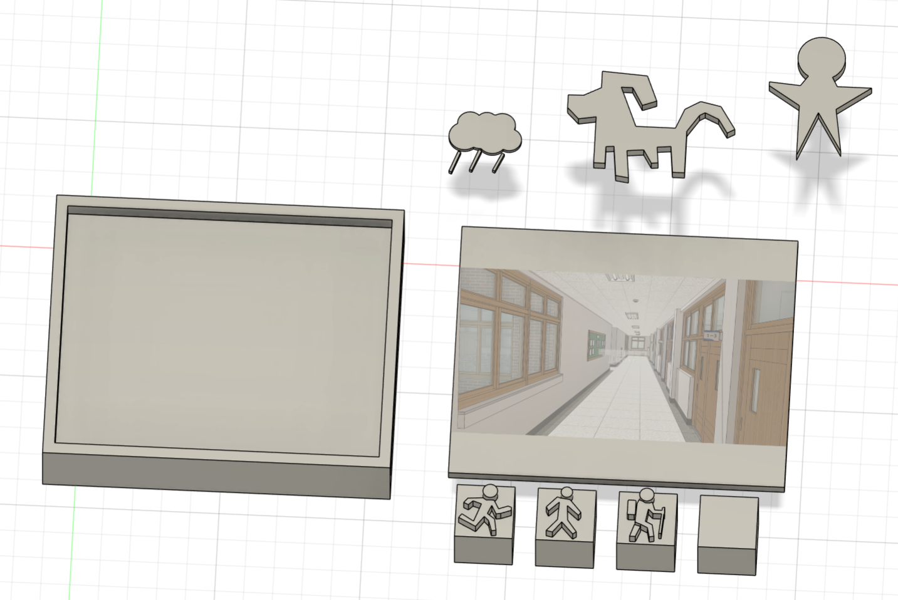
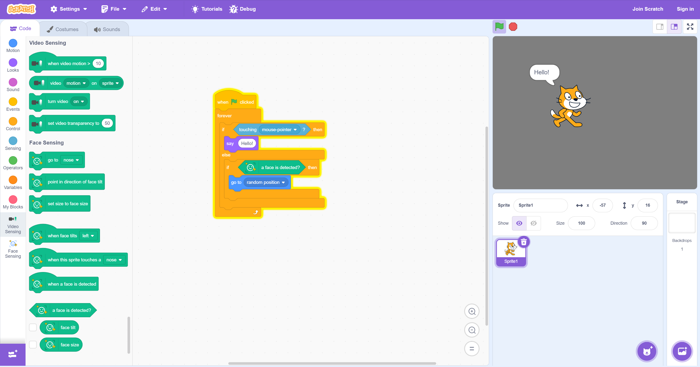
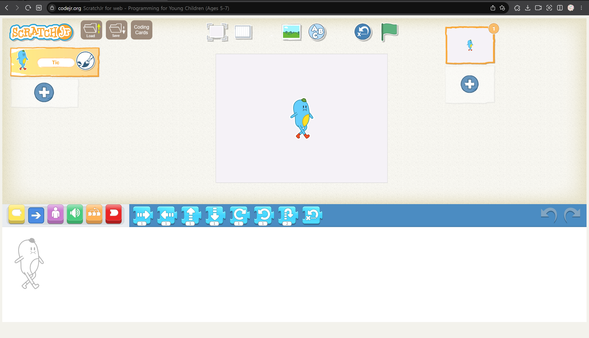

# 2025년 10월 16일 TIL

## 프롬프팅 도구 변경

- 기존: 블록을 통한 이야기 프롬프팅

- 변경: 장난감 교구를 통한 이야기 제작

---

## 비문해(非文解, 글을 읽고 이해하지 못함) 기반 표현 방식의 효과와 연구 근거

- 그림(이미지): 그림 그리기와 같은 시각적 표현은 글자를 몰라도 **직접적인 스토리텔링 수단**이 됩니다. 아이들은 그림을 통해 자신의 경험과 상상을 즉흥적으로 풀어낼 수 있고, 이는 **상징 인지 능력** 발달에도 기여

- 상징(아이콘): 글 대신 직관적인 **상징이나 아이콘**을 사용하면 유아도 **맥락을 이해**할 수 있습니다. 예를 들어 감정 이모티콘이나 그림 문자로 구성된 인터페이스는 아이들이 **메뉴와 도구의 의미**를 쉽게 알아채게 해주며, 복잡한 텍스트 설명 없이도 원하는 기능을 선택할 수 있게 합니다. 이러한 **픽토그램** 기반 소통은 발달장애 아동 의사소통(AAC) 분야에서도 효과가 검증되어 있을 만큼, **글자 능력이 없는 사용자**에게 보편적으로 유용합니다.

- 블록형 인터페이스: MIT에서 개발된 ScratchJr처럼 **블록 코딩 기반**의 저연령용 소프트웨어는, 명령어가 글자 대신 **그림 블록**으로 제공되어 **읽기 능력이 없는 아이들도 사용 가능**

- 음성 녹음 및 합성: 유아는 말을 할 줄 알기 때문에, 음성은 최적의 표현 도구. 실제 한 유치원 수업에서는 아이들이 그린 그림책에 자신의 목소리로 이야기를 녹음하여 디지털 스토리텔링을 했는데, 아이들 각자가 직접 쓴 글을 읽듯 자기 목소리로 이야기를 전달할 수 있었다

---

## 디지털 스토리텔링이 뭐고 어떤 효과가 있는가

- 아이들이 글이나 말로 직접 표현하기 어려운 생각과 감정을 영상과 이야기로 풀어낼 수 있게 해주는 유용한 도구

- 말로 설명하는 것이 어려운 아이라도, 만들어진 캐릭터와 그림, 음악을 통해 간접적으로 자신의 이야기를 전달할 수 있다

- 영상 기반 표현은 비언어적 단서와 스토리를 활용하기 때문에, 아이가 정확한 단어를 몰라도 이미지와 서사로 자신의 생각을 드러낼 수 있게 해주는 효과가 있습니다

- **비영리단체 Family for Every Child**가 발표한 보고서는 아동들이 참여형 디지털 스토리 제작 과정에서 “자신감이 커지고, 가족 내 대화가 풍부해지는” 효과를 경험했다고 기록

- **미국 교육매체 Edutopia**는 초등학생들이 Canva 등 AI도구로 자신의 이야기를 영상으로 제작할 때 아이들이 명확하고 자신 있게 말하는 법을 배우고, 발표 자신감 및 의사소통 능력이 향상되었다고 보도했습니다
