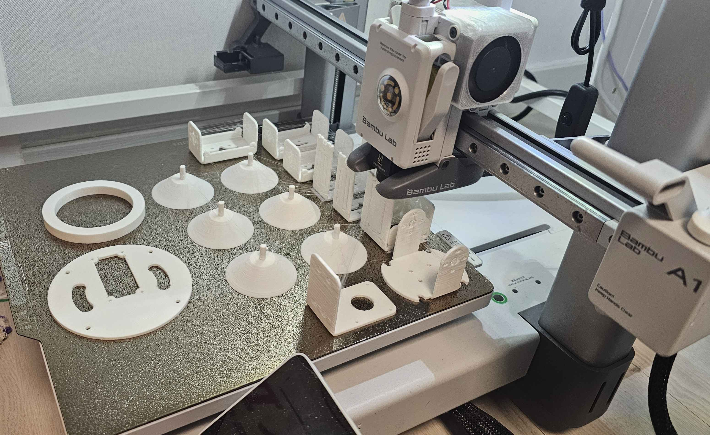

# 2025년 10월 23일 TIL

## KPT

#### 💪 **Keep (계속할 점)**

일정 관리를 위하여 로봇팔 구현 계획 TODO 작성

#### 😭 **Problem (문제점)**

교보재가 빨리 도착해서 빠른 몸통 모델링이 필요함

#### 🤙 **Try (새로운 시도)**

로봇 디자인 및 크기 가늠을 위해 DofBot STL파일 3D 프린트

