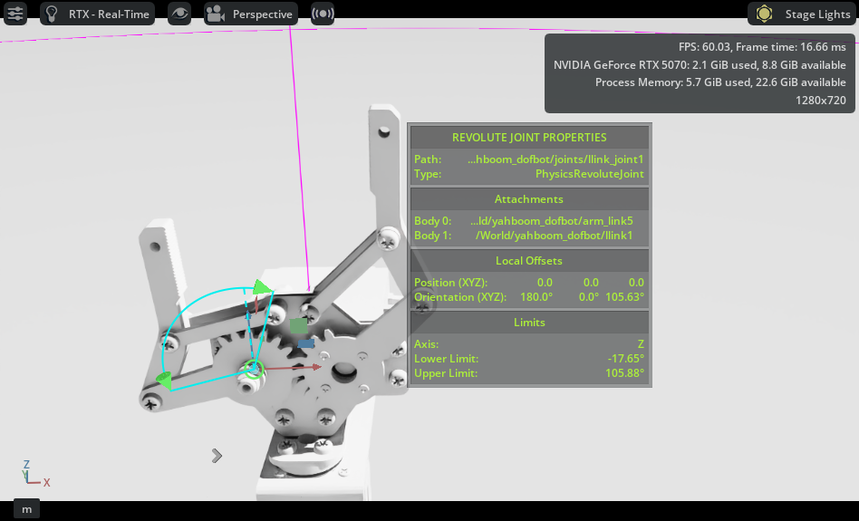

# 2025년 10월 28일 TIL

## KPT

#### 💪 **Keep (계속할 점)**

휴머로이드가 주유소에서 기름만 넣어주는데 뭔가 느낌이 없을수도 있겠다. 목적을 바꾸는것도 계속 고려해봐야겠다.

#### 😭 **Problem (문제점)**

일정 관리를 위해 국내 로봇팔은 무시하고 Dofbot을 기본으로 개발을 진행할 예정이다.

#### 🤙 **Try (새로운 시도)**

Issac Sim에서 USD구현시 실제 Force가 적용되는 Articulation은 회전이 잘 되나 반대편은 아래로 쳐지는 문제가 있었다. 이를 해결해기 위해 Force Joint를 Mimic Joint로 하고 Natural Frequency 값을 증가시키고 환경 자체의 Time Steps Per Second 값을 올렸다.

