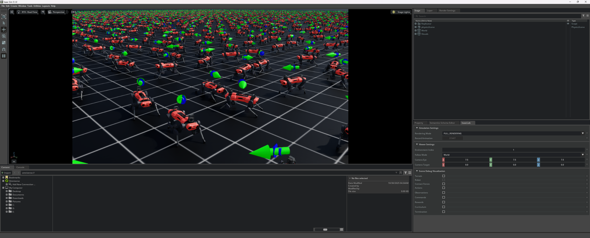

# 2025년 10월 29일 TIL

## KPT

#### 💪 **Keep (계속할 점)**

해외 직구 로봇 배송이 빨라짐에 따라 일정을 바꾼것은 잘한것 같다.

#### 😭 **Problem (문제점)**

로봇 학습에 있어서 조금 더 서둘러야할것 같다. 아직 기초부터 진행중이라 결과가 나올지 확실하지 않다.

#### 🤙 **Try (새로운 시도)**

Issac Lab설치 이후 예제 Script및 Tutorials를 통해서 Manager-Based와 Direct 강화학습 워크플로우의 구조 차이를 확인하고 강화학습시 Scene, Action, Observation, Reset Event, Reward, Termination, Env 전역 설정 등 필요한 설정들에 대해서 어떻게 만들어져있는지 확인했다.

