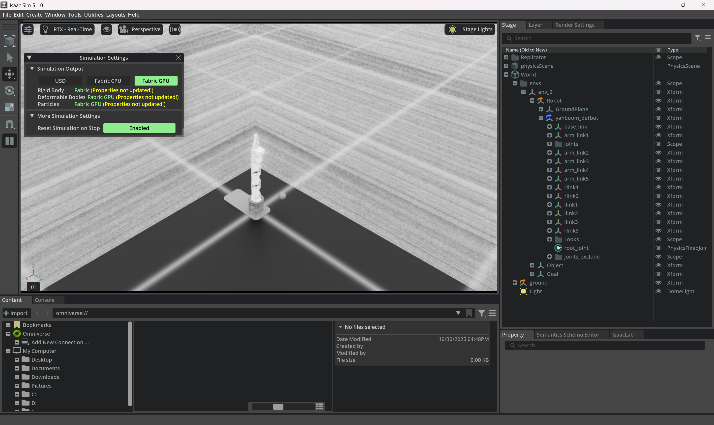
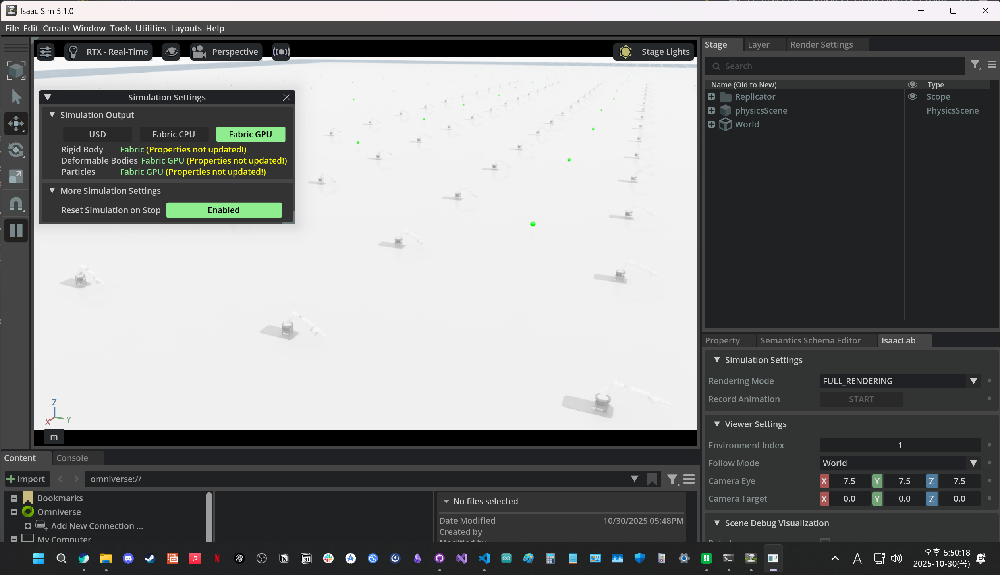

# 2025년 10월 30일 TIL

## KPT

#### 💪 **Keep (계속할 점)**

DofBot이 도착해서 다음날 조립 후 테스트 할 예정

#### 😭 **Problem (문제점)**

새로운 Robot Task에 대해서 어떤 Agent와 어떤 알고리즘을 써야할지 명확히 정하는 방법을 모르겠음

#### 🤙 **Try (새로운 시도)**

Issac Lab에서 Dofbot 강화학습을 위한 환경을 만드는 시도.

병렬 처리중 각각의 로봇이 똑같이 생기는 문제가 있음.

모든 관절이 계속 같은 행동을 하는 문제가 있음

