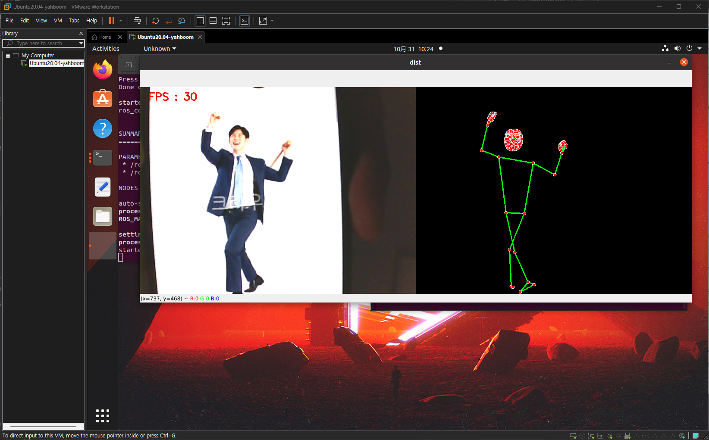
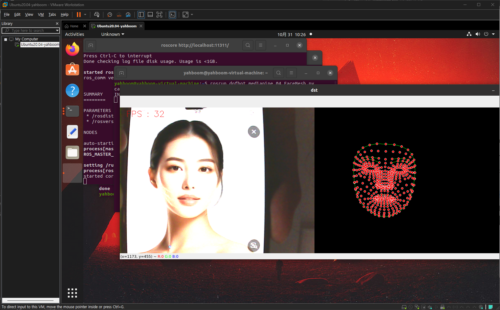
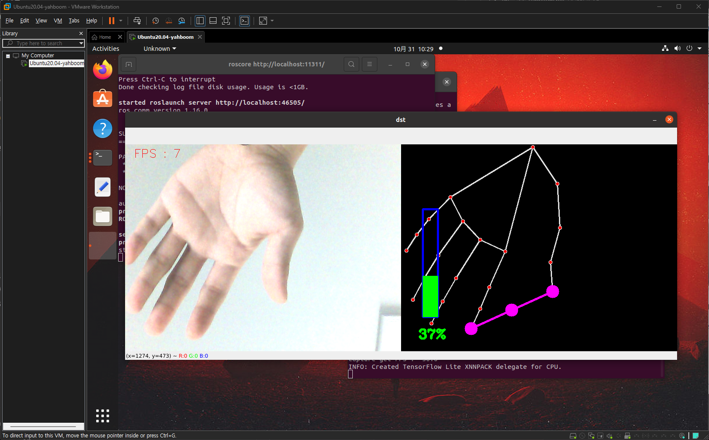
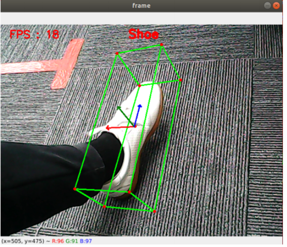

# 2025년 10월 31일 TIL

## KPT

#### 💪 **Keep (계속할 점)**

주제가 정혀져서 이제 해야할게 확실해졌다. 로봇의 바퀴 이동, 얼굴 표현, 팔 움직임 등 할게 많다.

#### 😭 **Problem (문제점)**

강화학습을 도입할만한 기능이 있는지 다시 찾아봐야겠다. 굳이 강화학습을 써야하는가?에대한 의문이 생겼다.

#### 🤙 **Try (새로운 시도)**

로봇팔에 달린 카메라로 미디어 파이프 코드를 테스트, Ros Moveit을 통한 로봇팔 움직임 테스트를 했다. 이제 코드를 열심히 봐서 내가 원하는 좌표로 움직이고 특정 행동을 하는 코드를 직접 만들어봐야겠다.

