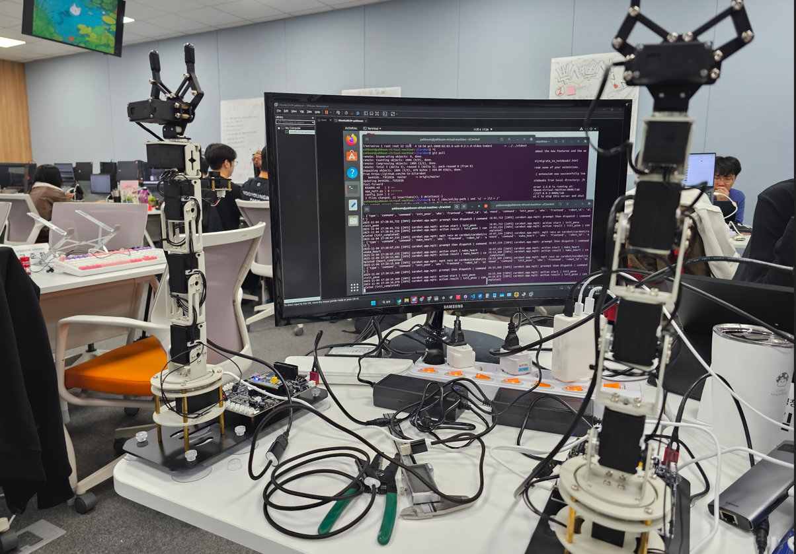

# 2025년 11월 04일 TIL

## KPT

#### 💪 **Keep (계속할 점)**

- 웹소켓보다 mqtt를 사용해보는 것을 추천받아서 이전작업 완료.

- 스프링부트에서도 준비되면 맞추는 작업 다시 진행 예정

#### 😭 **Problem (문제점)**

- 로봇팔마다 USB를 2개씩 총 4개가 필요한데 자꾸 연결이 끊긴다. USB 허브를 문제인가 다른 허브를 가져와서 맞춰봐야겠다.

#### 🤙 **Try (새로운 시도)**

- 로봇팔 2대를 한번에 컨트롤하는 코드로 변경했다.

