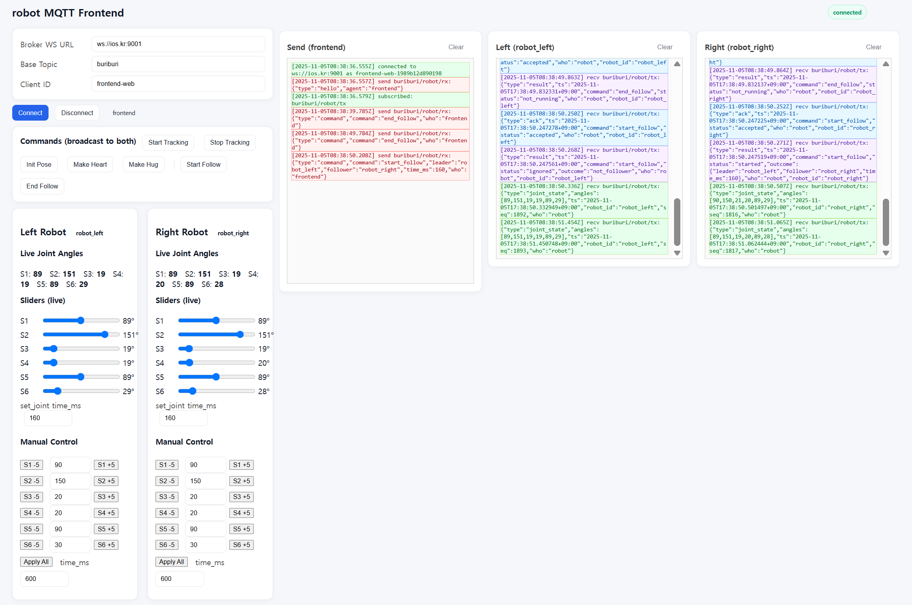

# 2025년 11월 05일 TIL

## KPT

#### 💪 **Keep (계속할 점)**

- 로봇팔 2개 MQTT로 동작하는 부분 구현을 했고 새로운 동작을 추가하는데 많은 시작이 들지 않는다.

#### 😭 **Problem (문제점)**

- 로봇팔을 아직도 바닥에 두고 쓰고있다. 로봇의 형상 제작을 우선시 하여 작업을 시작해야겠다.

#### 🤙 **Try (새로운 시도)**

- 로봇 얼굴 표현, 목 회전 등 빠르게 처리할 수 있는 부분을 처리해버려야겠다.

