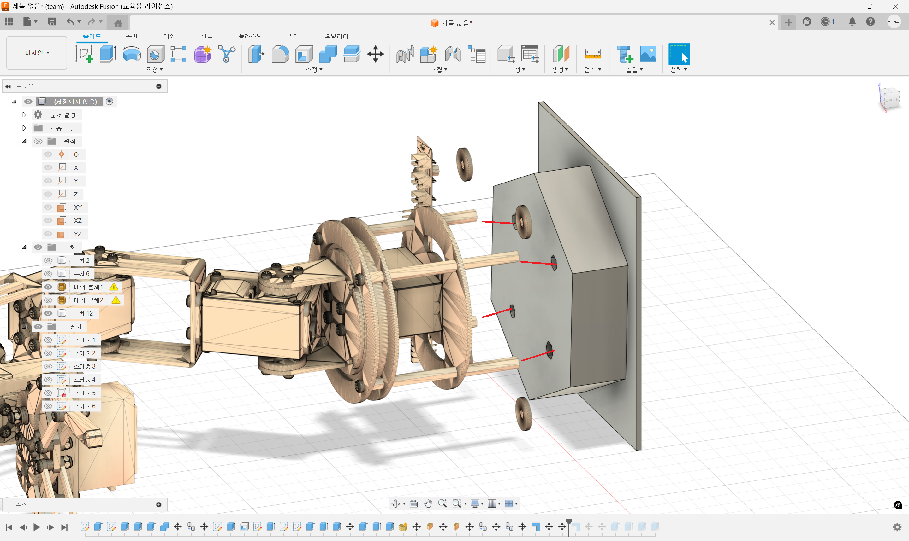
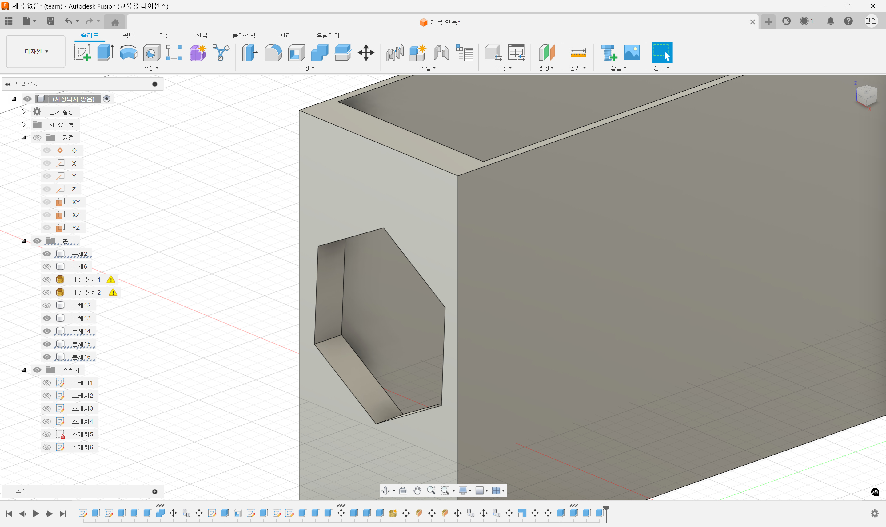
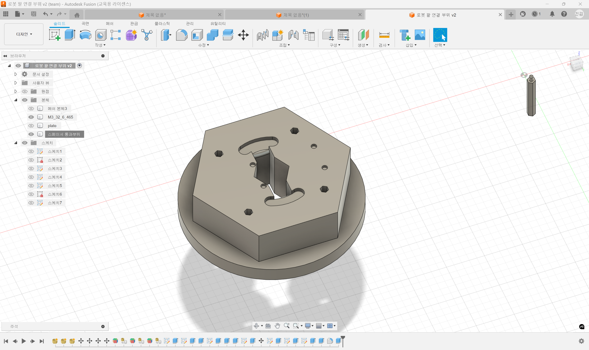

# 2025년 11월 06일 TIL

## KPT

#### 💪 **Keep (계속할 점)**

- 새로운 로봇 명령(hello, 가위바위보(체조)) 추가
- 정해진 일정에 따라 진행하고 여유공간으로 둔 일정을 잘 활용할것

#### 😭 **Problem (문제점)**

- 출력시간이 오래 걸리니 공차 여유두고 출력해야할것 한 번 실패하면 시간이 배로 필요하다

#### 🤙 **Try (새로운 시도)**

- 로봇 팔 연결 부위를 만들어 몸통에 연결을 용이하게 하게 해둠

